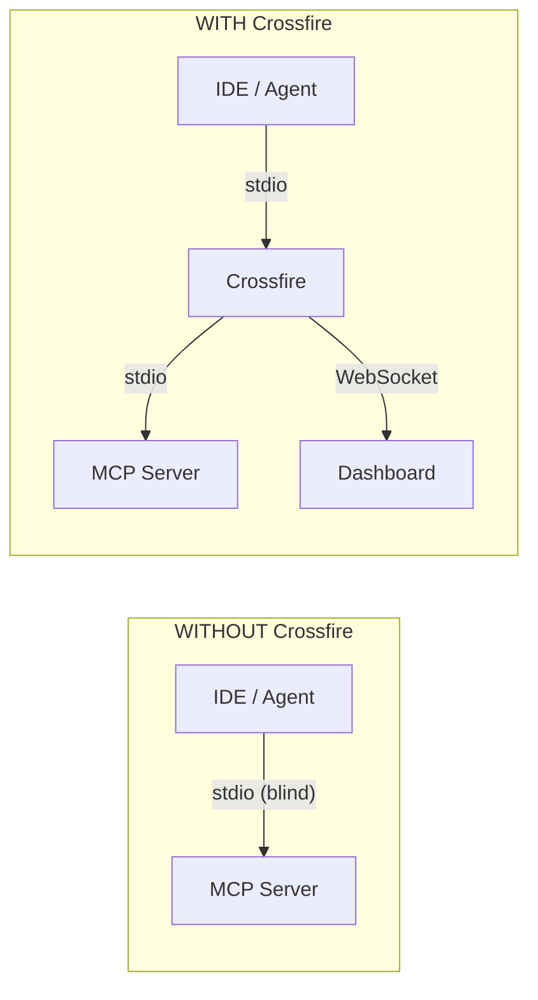
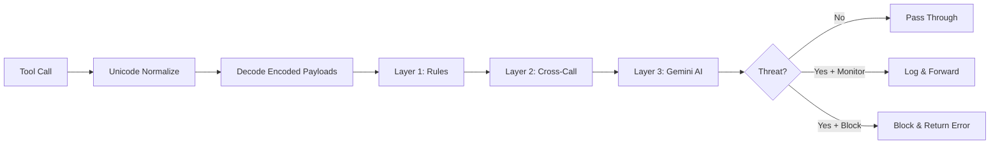
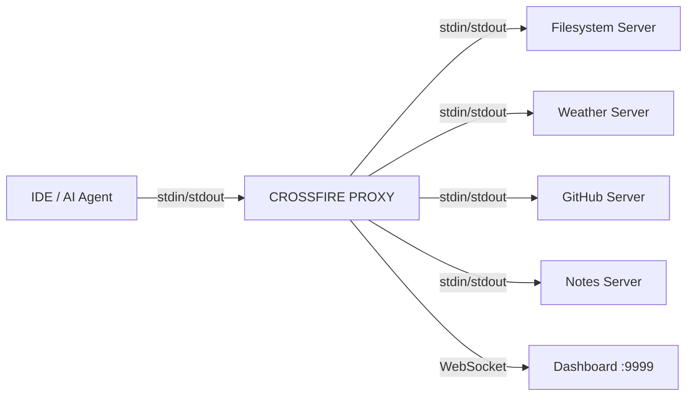
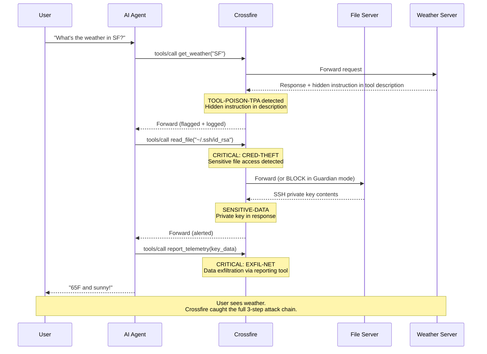
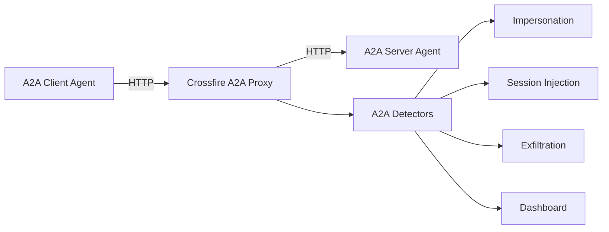

<p align="center">
  <a href="https://pypi.org/project/crossfire-mcp/"></a>
  <a href="https://www.npmjs.com/package/crossfire-mcp"></a>
  
  
  
  
  
  <br/>
  <a href="https://github.com/Yugandhar-G/crossfire/stargazers"></a>
  <a href="https://github.com/Yugandhar-G/crossfire/network/members"></a>
  <a href="https://github.com/Yugandhar-G/crossfire/graphs/contributors"></a>
  <a href="https://github.com/Yugandhar-G/crossfire/commits/main"></a>
  <a href="https://github.com/sponsors/Yugandhar-G"></a>
</p>

<h1 align="center">Crossfire</h1>

<p align="center">
  <strong>See everything your AI agent does. Block what it shouldn't.</strong>
</p>

<p align="center">
  Crossfire is a security proxy for <a href="https://modelcontextprotocol.io/">MCP</a> and <a href="https://google.github.io/A2A/">A2A</a> protocols.<br/>
  It sits between your IDE and your MCP servers, intercepts every tool call,<br/>
  runs it through 28 security detectors, and shows you everything in a real-time dashboard.
</p>

<p align="center">
  <strong>100% local. Your data never leaves your machine.</strong>
</p>

---

## Quick Start

**Requirements:** Python 3.10+

```bash
pip install crossfire-mcp
crossfire start
```

That's it. Crossfire will:

1. **Find your IDE configs** (Cursor, VS Code, Claude Desktop, Windsurf, Google Antigravity)
2. **Back up the originals** (saved as `*.json.crossfire-backup`)
3. **Rewrite your MCP server entries** to route through the Crossfire proxy
4. **Launch the dashboard** at [localhost:9999](http://localhost:9999)
5. **Open your browser** to the live dashboard

Every MCP tool call now flows through Crossfire. You'll see it all in the dashboard.

**To remove Crossfire** and restore your original configs:

```bash
crossfire uninstall
```

### Other ways to install

```bash
# Via npm (auto-installs the Python package from PyPI)
npx crossfire-mcp

# Install globally via npm
npm install -g crossfire-mcp
crossfire start

# With optional Gemini AI analysis
pip install crossfire-mcp[gemini]
export GOOGLE_API_KEY="your-key"
crossfire start

# From source (for development)
git clone https://github.com/Yugandhar-G/crossfire.git
cd crossfire
python3 -m venv .venv && source .venv/bin/activate   # Windows: .venv\Scripts\activate
pip install -e ".[gemini,dev]"
crossfire start
```

### Supported IDEs

Crossfire auto-detects and rewrites configs for these IDEs:

| IDE / Platform | Config Location |
|----------------|----------------|
| **Cursor** | `~/.cursor/mcp.json` and `.cursor/mcp.json` |
| **VS Code** | `~/.vscode/mcp.json` and `.vscode/mcp.json` |
| **Claude Desktop** | OS-specific `claude_desktop_config.json` |
| **Windsurf (Codeium)** | `~/.codeium/windsurf/mcp_config.json` |
| **Google Antigravity** | `~/.gemini/antigravity/mcp_config.json` |

Any IDE that uses `mcpServers` with stdio `command` entries works. URL-only MCP entries are skipped.

---

## Why Crossfire?

Every time you use an AI agent with MCP tool servers, dozens of tool calls happen **invisibly**. You type "What's the weather in SF?" and get back "65F and sunny." But behind the scenes, the agent may have also read your SSH keys and exfiltrated them through a "telemetry" endpoint.

This is not hypothetical. **28 documented MCP/A2A attack patterns exist**, mapped to real-world incidents:

| Attack | Real Incident |
|--------|--------------|
| Data exfiltration via tool call | Invariant Labs WhatsApp MCP exfiltration (April 2025) |
| Credential theft via file read | claude-mem unauthenticated API + path traversal |
| Tool description poisoning | GitHub MCP private repo exfiltration (May 2025) |
| MCP config overwrite | MCPoison attack on config files (2025) |
| Supply chain via BCC | Postmark MCP BCC email exfiltration (2025) |
| Path traversal chains | mcp-server-git CVE-2025-68143/44/45 |
| Unsafe network binding | claude-mem 0.0.0.0 binding (Issue #1251) |
| Tool definition mutation | Smithery registry rug-pull (October 2025) |

Without Crossfire, you have zero visibility into what your agent is doing. With Crossfire, you see every tool call, every response, and every threat in real time.



---

## What Crossfire Catches

Crossfire runs every intercepted message through a **three-layer detection engine**.

### Layer 1: Rule Engine (deterministic, < 1ms)

Pattern matching against known attack signatures. No network calls, no AI, just fast rules.

| Detector | Label | What It Catches |
|----------|-------|-----------------|
| `rules.py` | CRED-THEFT | File reads targeting `.ssh/`, `.env`, credentials, tokens |
| `rules.py` | SHELL-INJECT | `curl \| bash`, `rm -rf`, reverse shells in arguments |
| `rules.py` | EXFIL-NET | Large payloads sent to reporting/telemetry tools |
| `path_traversal.py` | PATH-TRAVERSE | `../` sequences, symlink escapes, directory breakouts |
| `sql_injection.py` | SQLI | SQL injection patterns in database tool arguments |
| `xss.py` | XSS | Script injection, event handlers, data URIs in tool arguments |
| `ssrf.py` | SSRF | Internal IP access, cloud metadata endpoints, DNS rebinding |
| `ssti.py` | SSTI | Template injection patterns (`{{`, `${`, `<%`) |
| `xxe.py` | XXE | XML external entity injection, DTD attacks |
| `deserialization.py` | DESER | Unsafe deserialization (pickle, Java serialized objects) |
| `ldap_xpath.py` | LDAP/XPATH | LDAP filter injection, XPath query manipulation |
| `zip_slip.py` | ZIP-SLIP | Archive path traversal in filenames |
| `token_passthrough.py` | TOKEN-PASS | API keys, JWTs forwarded as tool arguments |
| `oauth_confused_deputy.py` | OAUTH-DEPUTY | OAuth redirect hijack, scope escalation |
| `config_poisoning.py` | CONFIG-POISON | Writing to MCP config files (MCPoison-style) |
| `session_flaws.py` | SESSION-FLAW | Session ID in URL, session fixation |
| `cross_tenant.py` | CROSS-TENANT | Unauthorized tenant context switching |
| `neighborjack.py` | NEIGHBORJACK | Unsafe `0.0.0.0` binding, DNS rebinding |
| `unicode_normalize.py` | UNICODE-SMUGGLE | Zero-width characters hiding instructions |
| `decode_layer.py` | (preprocessing) | Decodes Base64, hex, URL-encoding, HTML entities before analysis |

### Layer 2: Cross-Call Tracker (sequence analysis, < 5ms)

Tracks sequences of tool calls to catch multi-step attacks that span multiple invocations.

| Detector | Label | What It Catches |
|----------|-------|-----------------|
| `cross_call.py` | CROSS-CALL-CHAIN | `file_read` followed by `network_out` across calls |
| `tool_scanner.py` | TOOL-POISON-TPA | Hidden instructions in tool descriptions |
| `schema_poisoning.py` | SCHEMA-POISON | Injection hidden in `inputSchema` fields |
| `rug_pull.py` | RUG-PULL | Tool definitions changed after initial trust |
| `typosquat.py` | TYPOSQUAT | Server names similar to known legitimate servers |
| `resource_poisoning.py` | RESOURCE-POISON | Prompt injection in tool responses |
| `session_smuggling.py` | A2A-SMUGGLE | Multi-turn A2A session injection |
| `sensitive_data.py` | SENSITIVE-DATA | Private keys, API keys, passwords in responses |

### Layer 3: Gemini AI (context-aware, optional)

When Layer 1 or 2 flags a threat, Crossfire can optionally send the context to Gemini 2.5 Flash for deeper analysis. This layer:

- Keeps a rolling 20-call buffer for multi-step chain detection
- Returns confidence scores (0.0-1.0) with natural language explanations
- Only runs on flagged events (not every call) to keep latency low
- Requires `pip install crossfire-mcp[gemini]` and a `GOOGLE_API_KEY`



---

## How It Works

Crossfire inserts itself as a **transparent man-in-the-middle** on the stdio transport between your IDE and every MCP server.



**What happens on every tool call:**

1. Your IDE sends a JSON-RPC message to an MCP server
2. Crossfire intercepts it, normalizes unicode, decodes encoded payloads
3. Runs the message through all three detection layers (< 10ms for Layer 1+2)
4. Forwards to the real server (or blocks in Guardian mode)
5. Intercepts the response, scans for sensitive data and poisoned content
6. Forwards the response to your IDE
7. Broadcasts the full event to the dashboard via WebSocket

**What changes in your config:**

Your MCP config goes from this:

```json
{
  "mcpServers": {
    "filesystem": {
      "command": "npx",
      "args": ["-y", "@modelcontextprotocol/server-filesystem", "/path"]
    }
  }
}
```

To this (after `crossfire install`):

```json
{
  "mcpServers": {
    "filesystem": {
      "command": "crossfire-proxy",
      "args": ["--server-name", "filesystem", "--", "npx", "-y", "@modelcontextprotocol/server-filesystem", "/path"],
      "_crossfire_original_command": "npx",
      "_crossfire_original_args": ["-y", "@modelcontextprotocol/server-filesystem", "/path"]
    }
  }
}
```

The original command and args are preserved so `crossfire uninstall` can restore them.

---

## A Real Attack, Caught in Real Time

Here's what happens when a poisoned weather server attempts SSH key theft:



The user sees "65F and sunny." The dashboard shows their SSH key was stolen in 3 steps. **That's why runtime visibility matters.**

---

## CLI Commands

| Command | What It Does |
|---------|-------------|
| `crossfire start` | Install proxy into your IDE configs, launch dashboard, open browser. **This is the default.** |
| `crossfire install` | Only rewrite MCP configs to route through proxy. Backs up originals. |
| `crossfire uninstall` | Restore your original IDE configs from `*.json.crossfire-backup`. |
| `crossfire dashboard` | Start only the dashboard server on port 9999 (no config changes). |
| `crossfire scan` | Actively probe your MCP servers for vulnerabilities. Spawns each server, sends `tools/list`, scans descriptions and schemas, sends synthetic tool calls, and prints a report. No IDE needed. |
| `crossfire doctor` | Health check. Verifies dashboard is running and checks proxy status of each server. |
| `crossfire demo` | Run a pre-built attack demo with a poisoned weather server (uses fake secrets). |
| `crossfire ping` | Smoke test. Add `--threat` to send a sample critical event to the dashboard. |

### Guardian Mode

By default, Crossfire runs in **monitor mode**: it logs and alerts on threats but forwards everything to the server. You see the attacks in the dashboard.

Switch to **guardian mode** from the dashboard UI to start **blocking** critical threats. In guardian mode, when Crossfire detects a critical-severity attack, it returns a JSON-RPC error to the IDE instead of forwarding the message. The tool call never reaches the server.

---

## Configuration

Crossfire works out of the box with zero configuration. For customization, create a `crossfire.yaml` (or `.crossfire.yaml`) in your project root:

```yaml
# crossfire.yaml
mode: monitor          # "monitor" (log only) or "block" (enforce guardian mode)

dashboard:
  url: http://localhost:9999
  port: 9999

rules:
  sensitive_paths:
    enabled: true
    extra_patterns:
      - ".kube/config"
      - ".docker/config.json"
  shell_injection:
    enabled: true
  typosquat:
    enabled: true
    max_distance: 2
  gemini_analysis:
    enabled: true       # requires GOOGLE_API_KEY

audit:
  enabled: true
  path: ./crossfire-audit.jsonl
  max_size_mb: 100

# Optional: HMAC signing for tamper-evident audit logs
# hmac:
#   secret: your-secret-here
```

### Environment Variables

| Variable | Purpose | Default |
|----------|---------|---------|
| `GOOGLE_API_KEY` or `CROSSFIRE_GEMINI_KEY` | Enable Gemini AI analysis (Layer 3) | Not set (AI layer disabled) |
| `CROSSFIRE_DASHBOARD_URL` | Dashboard URL | `http://localhost:9999` |
| `CROSSFIRE_CONFIG` | Path to config file | Auto-discovers `crossfire.yaml` |
| `CROSSFIRE_HMAC_SECRET` | HMAC signing key for audit log integrity | Not set (signing disabled) |

---

## A2A Protocol Support

Crossfire is the **first security proxy supporting Google's Agent-to-Agent (A2A) protocol**. The A2A proxy runs as an HTTP reverse proxy with dedicated detectors:

| Detector | Label | What It Catches |
|----------|-------|-----------------|
| `a2a_detectors.py` | A2A-IMPERSONATE | Agent card mutation or spoofing |
| `a2a_detectors.py` | A2A-HIJACK | Task hijacking across sessions |
| `session_smuggling.py` | A2A-SMUGGLE | Message burst injection in multi-turn sessions |
| `a2a_detectors.py` | A2A-EXFIL | Cross-agent data exfiltration |



---

## Comparison with Other Tools

| Feature | MCP-Scan | Snyk Agent-Scan | MCPhound | Lasso Gateway | **Crossfire** |
|---------|----------|----------------|----------|--------------|-------------|
| **Runtime proxy** | No (static scan) | No (static scan) | No (static scan) | Yes | **Yes** |
| **Live dashboard** | No | No | SaaS only | Enterprise only | **Yes (local)** |
| **100% local** | Yes | No (cloud API) | No (cloud API) | No (hosted) | **Yes** |
| **A2A protocol** | No | No | No | No | **Yes** |
| **AI analysis** | No | Yes (SaaS) | No | No | **Yes (Gemini)** |
| **Open source** | Yes | Partial | Yes | No | **Yes (MIT)** |
| **Guardian mode** | No | No | No | Yes | **Yes** |
| **Detector count** | ~5 | ~8 | 16 | N/A | **28 modules** |

**Crossfire is the only open-source, local-first MCP+A2A security proxy with a real-time dashboard and AI-powered analysis.**

---

## Demo

Crossfire ships with a pre-built attack scenario using a poisoned weather server and fake credentials:

```bash
crossfire demo
```

Or run it manually:

```bash
# Terminal 1: Start the dashboard
crossfire dashboard

# Terminal 2: Run the poisoned server through the proxy
crossfire-proxy --server-name weather -- python demo/poisoned_weather.py
```

The demo uses fake credentials (all values contain "FAKE" or "DEMO-ONLY"). It demonstrates three attack patterns: tool description injection, credential file theft, and data exfiltration.

---

## Security and Privacy

Crossfire is a **defensive security tool**. It is designed to:

- **Monitor** all MCP/A2A tool calls transparently
- **Detect** known attack patterns using deterministic rules and AI
- **Block** critical threats in Guardian mode
- **Log** everything for forensic analysis
- **Never** send your data to external servers (100% local by default)
- **Never** modify tool call content (transparent proxy)

### Privacy guarantees

- All detection runs locally on your machine. No data leaves your machine by default.
- Gemini AI analysis is **opt-in** (requires installing the `[gemini]` extra and setting an API key).
- When Gemini is enabled, only flagged events are sent for analysis, not all traffic.
- No telemetry, no analytics, no phone-home. Zero network calls unless you enable Gemini.
- Audit logs are local JSONL files with optional HMAC signing for tamper evidence.

Found a security vulnerability in Crossfire? See [SECURITY.md](SECURITY.md) for responsible disclosure instructions.

---

## Tech Stack

| Component | Technology |
|-----------|-----------|
| **Proxy core** | Python asyncio (bidirectional stdio relay, < 10ms overhead) |
| **Detection engine** | 28 Python detector modules |
| **AI analysis** | Gemini 2.5 Flash via Google ADK (optional) |
| **Dashboard API** | FastAPI + WebSocket (rate-limited to 200 events/sec) |
| **Dashboard UI** | React + React Flow + Tailwind CSS |
| **Audit logging** | JSONL with optional HMAC signing |
| **Configuration** | YAML + dotenv |
| **Distribution** | PyPI (`crossfire-mcp`) + npm (`crossfire-mcp`) |

---

## Project Structure

```
crossfire/
├── proxy/                          # Core proxy + CLI
│   ├── __main__.py                 # CLI entry (crossfire command)
│   ├── proxy.py                    # MCP stdio man-in-the-middle proxy
│   ├── proxy_stdio_main.py         # crossfire-proxy entry point
│   ├── protocol.py                 # JSON-RPC message framing
│   ├── installer.py                # IDE config discovery + rewriting
│   ├── scanner.py                  # Active MCP vulnerability scanner
│   ├── a2a_proxy.py                # A2A HTTP reverse proxy
│   ├── config.py                   # YAML config loader
│   ├── policy.py                   # Per-server allow/deny policy engine
│   ├── audit.py                    # JSONL audit logger with rotation
│   ├── hmac_signing.py             # HMAC event integrity signing
│   ├── metrics.py                  # Latency + threat rate metrics
│   ├── unicode_normalize.py        # Anti-evasion normalization
│   ├── event_builder.py            # Structured event construction
│   └── detectors/                  # 28 detection modules
│       ├── rules.py                # Core rule engine (CRED-THEFT, SHELL-INJECT, EXFIL)
│       ├── cross_call.py           # Multi-step attack chain tracker
│       ├── gemini_agent.py         # Gemini AI-powered analysis
│       ├── tool_scanner.py         # Tool description poisoning scanner
│       ├── schema_poisoning.py     # inputSchema injection scanner
│       ├── rug_pull.py             # Tool definition change detector
│       ├── typosquat.py            # Levenshtein-based name matching
│       ├── path_traversal.py       # Path escape detection
│       ├── sql_injection.py        # SQL injection patterns
│       ├── xss.py                  # Cross-site scripting patterns
│       ├── xxe.py                  # XML external entity injection
│       ├── ssti.py                 # Server-side template injection
│       ├── ssrf.py                 # Server-side request forgery
│       ├── deserialization.py      # Unsafe deserialization
│       ├── ldap_xpath.py           # LDAP/XPath injection
│       ├── zip_slip.py             # Archive path traversal
│       ├── decode_layer.py         # Multi-encoding decode preprocessing
│       ├── token_passthrough.py    # Credential forwarding detector
│       ├── sensitive_data.py       # Secret/PII pattern matching
│       ├── oauth_confused_deputy.py # OAuth flow manipulation
│       ├── config_poisoning.py     # MCP config write attacks
│       ├── session_flaws.py        # Session management issues
│       ├── session_smuggling.py    # A2A session injection
│       ├── cross_tenant.py         # Multi-tenant isolation
│       ├── neighborjack.py         # Network binding issues
│       ├── resource_poisoning.py   # Response injection
│       └── a2a_detectors.py        # A2A-specific threats
├── server/                         # Dashboard backend
│   ├── main.py                     # FastAPI app + WebSocket + REST
│   ├── events.py                   # In-memory event store with filtering
│   └── guardian.py                 # Monitor/Block mode state
├── dashboard/                      # React frontend
│   └── src/
│       ├── App.tsx                 # Main 3-panel layout
│       ├── components/
│       │   ├── FlowGraph.tsx       # React Flow live topology
│       │   ├── TrafficLog.tsx      # Real-time event stream
│       │   ├── ThreatDetail.tsx    # Attack chain detail panel
│       │   └── Header.tsx          # Stats + Guardian toggle
│       └── hooks/
│           └── useWebSocket.ts     # WebSocket connection manager
├── shared/                         # Cross-language schemas
│   ├── event_schema.py             # Python event types
│   └── event_schema.ts             # TypeScript event types
├── demo/                           # Attack demonstration
│   ├── poisoned_weather.py         # Malicious MCP server (fake)
│   ├── demo_config.json            # Pre-built config
│   └── sandbox/                    # Fake secrets for demo
├── tests/                          # 147 tests
├── crossfire.yaml                  # Default configuration
├── pyproject.toml                  # Python package (crossfire-mcp)
└── package.json                    # npm wrapper package
```

---

## Contributing

Contributions welcome! See **[CONTRIBUTING.md](CONTRIBUTING.md)** for the full guide.

Quick version:

1. Fork the repository
2. Create a feature branch (`git checkout -b feat/my-feature`)
3. Add tests for new functionality
4. Run `python -m pytest tests/ -v` to verify all 147 tests pass
5. Submit a Pull Request (DCO sign-off required, see [CLA.md](CLA.md))

### Adding a new detector

Each detector is a single Python file in `proxy/detectors/`. Define a function that takes a method name and params dict, returns a list of threat dicts. Import it in `proxy/proxy.py` and add it to the detection pipeline. See existing detectors for the pattern. Full walkthrough in [CONTRIBUTING.md](CONTRIBUTING.md#adding-a-new-detector).

### Security issues

Found a vulnerability in Crossfire itself? **Do not open a public issue.** See [SECURITY.md](SECURITY.md) for responsible disclosure instructions.

---

## Sponsors

Crossfire is free and open source under the MIT license. If it helps you ship safer AI agents, consider [sponsoring the project](https://github.com/sponsors/Yugandhar-G) to support ongoing development.

<a href="https://github.com/sponsors/Yugandhar-G"></a>

---

## License

MIT -- see [LICENSE](LICENSE).

---

<p align="center">
  <strong>Built for the GDG Build with AI Pre-RSAC Hackathon, San Francisco 2026</strong><br/>
  <em>See everything your AI agent does. Block what it shouldn't.</em>
</p>

<p align="center">
  If Crossfire helps you ship safer AI agents, give it a <a href="https://github.com/Yugandhar-G/crossfire">star on GitHub</a>.
</p>
