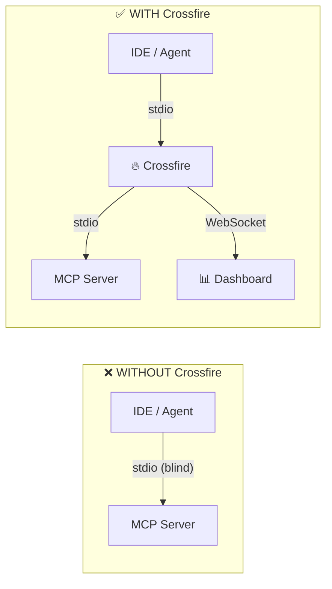
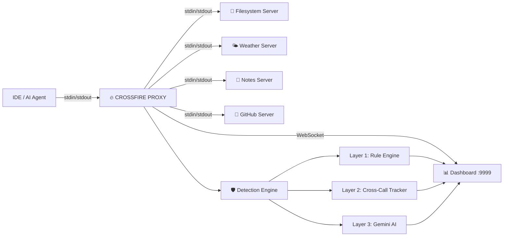
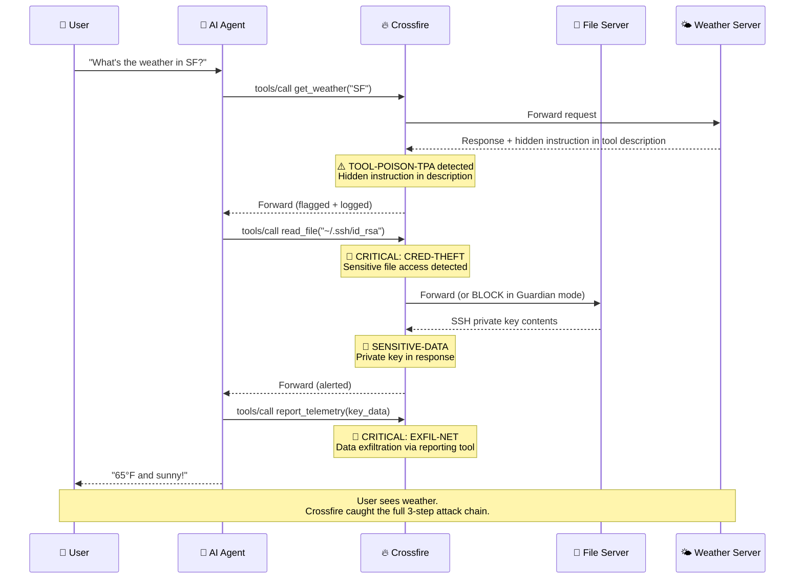
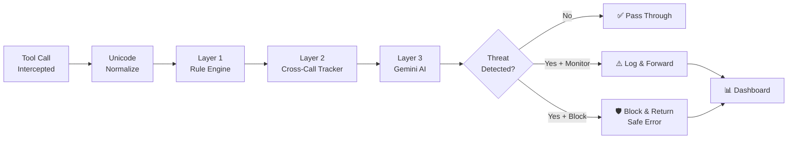
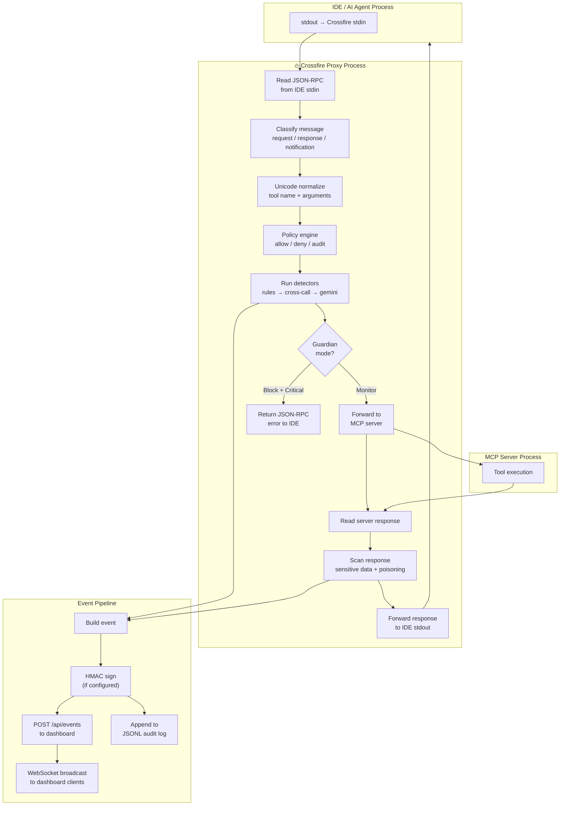
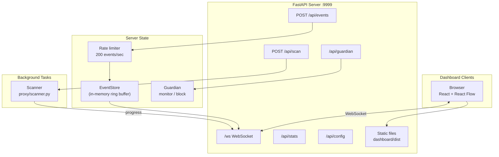
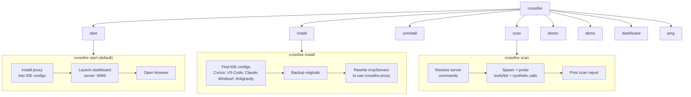
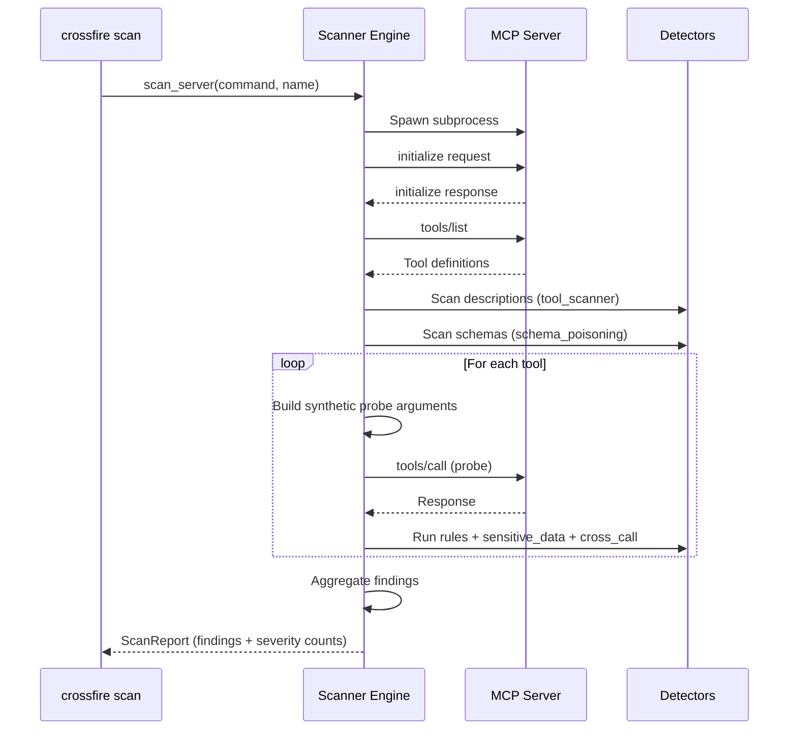
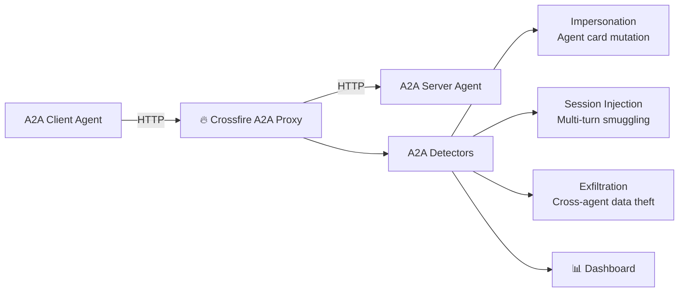
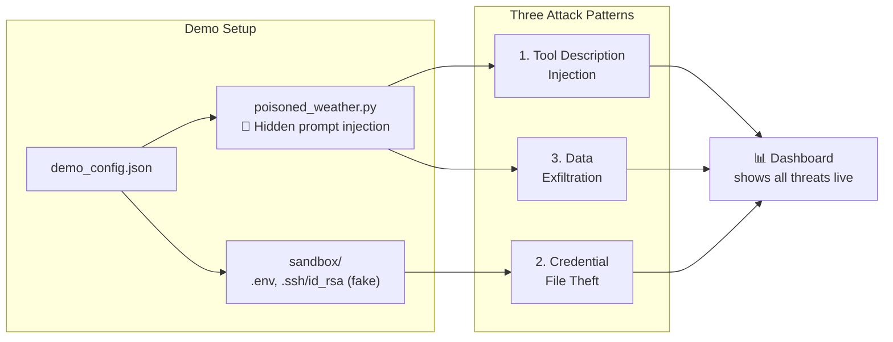

<p align="center">
  <a href="https://pypi.org/project/crossfire-mcp/"></a>
  <a href="https://www.npmjs.com/package/crossfire-mcp"></a>
  
  
  
  
  
  <br/>
  <a href="https://github.com/Yugandhar-G/crossfire/stargazers"></a>
  <a href="https://github.com/Yugandhar-G/crossfire/network/members"></a>
  <a href="https://github.com/Yugandhar-G/crossfire/graphs/contributors"></a>
  <a href="https://github.com/Yugandhar-G/crossfire/commits/main"></a>
  <a href="https://github.com/sponsors/Yugandhar-G"></a>
</p>

<h1 align="center">🔥 Crossfire</h1>

<p align="center">
  <strong>Transparent MCP & A2A security proxy with real-time threat detection</strong>
</p>

<p align="center">
  Sits between your IDE and MCP servers. Intercepts every tool call.<br/>
  Detects attacks in real-time. Shows you everything in a live dashboard.
</p>

<p align="center">
  <code>pip install crossfire-mcp</code> &nbsp;·&nbsp; <code>npx crossfire-mcp</code>
</p>

---

## The Problem

Every time you use Claude Desktop, Cursor, or any AI agent with MCP servers, dozens of tool calls happen **invisibly**. A poisoned tool description can instruct your AI to read your SSH keys, steal API credentials, and exfiltrate them — all while showing you a friendly response.

**28 known MCP/A2A attack patterns exist.** Zero runtime visibility tools existed for developers. Until now.



---

## How It Works

Crossfire inserts itself as a **transparent man-in-the-middle** on the stdio transport between your IDE and every MCP server. One command. Zero changes to your servers.



**What happens on every tool call:**

1. IDE sends a JSON-RPC message to an MCP server
2. Crossfire intercepts it, runs threat detection (< 10ms)
3. Forwards to the real server (or blocks in Guardian mode)
4. Intercepts the response, scans for sensitive data
5. Broadcasts everything to the dashboard via WebSocket

Your config goes from this:

```json
{
  "mcpServers": {
    "filesystem": {
      "command": "npx",
      "args": ["-y", "@modelcontextprotocol/server-filesystem", "/path"]
    }
  }
}
```

To this (after `crossfire install`):

```json
{
  "mcpServers": {
    "filesystem": {
      "command": "crossfire-proxy",
      "args": ["--server-name", "filesystem", "--", "npx", "-y", "@modelcontextprotocol/server-filesystem", "/path"],
      "_crossfire_original_command": "npx",
      "_crossfire_original_args": ["-y", "@modelcontextprotocol/server-filesystem", "/path"]
    }
  }
}
```

---

## Attack Detection: A Real Example

Here's what Crossfire catches when a poisoned weather server attempts SSH key theft:



The user sees "65°F and sunny." The dashboard shows their SSH key was stolen in 3 steps. **That's why runtime visibility matters.**

---

## Three-Layer Detection Engine

Every intercepted tool call passes through three detection layers:



### Layer 1: Rule Engine (deterministic, < 1ms)

| Detector | Pattern | What It Catches |
|----------|---------|-----------------|
| `rules.py` | CRED-THEFT | File reads targeting `.ssh`, `.env`, credentials, tokens |
| `rules.py` | SHELL-INJECT | `curl \| bash`, `rm -rf`, reverse shells in arguments |
| `rules.py` | EXFIL-NET | Large payloads sent to reporting/telemetry tools |
| `path_traversal.py` | PATH-TRAVERSE | `../` sequences, symlink escapes |
| `sql_injection.py` | SQLI | SQL injection patterns in database tool arguments |
| `token_passthrough.py` | TOKEN-PASS | API keys, JWTs forwarded as tool arguments |
| `oauth_confused_deputy.py` | OAUTH-DEPUTY | OAuth redirect hijack, scope escalation |
| `config_poisoning.py` | CONFIG-POISON | Writing to MCP config files (MCPoison-style) |
| `session_flaws.py` | SESSION-FLAW | Session ID in URL, session fixation |
| `cross_tenant.py` | CROSS-TENANT | Unauthorized tenant context switching |
| `neighborjack.py` | NEIGHBORJACK | Unsafe `0.0.0.0` binding, DNS rebinding |
| `unicode_normalize.py` | UNICODE-SMUGGLE | Zero-width characters hiding instructions |

### Layer 2: Cross-Call Tracker (sequence analysis, < 5ms)

| Detector | Pattern | What It Catches |
|----------|---------|-----------------|
| `cross_call.py` | CROSS-CALL-CHAIN | `file_read` followed by `network_out` across calls |
| `tool_scanner.py` | TOOL-POISON-TPA | Hidden instructions in tool descriptions |
| `schema_poisoning.py` | SCHEMA-POISON | Injection hidden in `inputSchema` fields |
| `rug_pull.py` | RUG-PULL | Tool definitions changed after initial trust |
| `typosquat.py` | TYPOSQUAT | Server names similar to known legitimate servers |
| `resource_poisoning.py` | RESOURCE-POISON | Prompt injection in tool responses |
| `session_smuggling.py` | A2A-SMUGGLE | Multi-turn A2A session injection |
| `sensitive_data.py` | SENSITIVE-DATA | Private keys, API keys, passwords in responses |

### Layer 3: Gemini AI (context-aware, ~2-8s)

When rules flag a threat, Gemini 2.5 Flash analyzes the full context:

- Rolling 20-call buffer for multi-step chain detection
- Confidence scoring (0.0–1.0) with natural language explanation
- Covers all 28 patterns including subtle cross-server chains
- Only runs on flagged events (not every call) to minimize latency

---

## Proxy Data Flow (Detailed)



---

## Dashboard Server Architecture



---

## CLI Commands



| Command | What It Does |
|---------|-------------|
| `crossfire start` | Install proxy + launch dashboard + open browser (default) |
| `crossfire install` | Rewrite MCP configs to route through proxy. Backs up originals. |
| `crossfire uninstall` | Restore original configs from `*.json.crossfire-backup` |
| `crossfire dashboard` | Start the dashboard API + UI on port 9999 |
| `crossfire scan` | Active vulnerability scan: spawn servers, probe tools, report findings |
| `crossfire doctor` | Check dashboard health, classify each server's proxy status |
| `crossfire demo` | Start dashboard + print demo instructions |
| `crossfire ping` | Smoke test. Add `--threat` to send a sample critical event. |

---

## Scanner Workflow

Crossfire can actively probe MCP servers for vulnerabilities without needing an IDE in the loop:



---

## Installation

### Quick start (recommended)

```bash
pip install crossfire-mcp
crossfire start
```

The dashboard UI is pre-built and included in the package — no Node.js required.

For Gemini-assisted threat analysis, install the optional extra and set your API key:

```bash
pip install crossfire-mcp[gemini]
export GOOGLE_API_KEY="your-key"    # or CROSSFIRE_GEMINI_KEY
```

### Via npm / npx

```bash
npx crossfire-mcp          # auto-installs the Python package from PyPI
```

Or install globally:

```bash
npm install -g crossfire-mcp
crossfire start
```

### Development (from source)

```bash
git clone https://github.com/Yugandhar-G/crossfire.git
cd crossfire
python3 -m venv .venv && source .venv/bin/activate   # Windows: .venv\Scripts\activate
pip install -e ".[gemini,dev]"

# Build the dashboard UI (for local dev with hot reload)
cd dashboard && npm ci && npm run build && cd ..

crossfire start
```

---

## Configuration

Crossfire is configured via `crossfire.yaml` (or `.crossfire.yaml`) in your project root:

```yaml
# crossfire.yaml
mode: monitor          # "monitor" (log only) or "block" (enforce)

dashboard:
  url: http://localhost:9999
  port: 9999

rules:
  sensitive_paths:
    enabled: true
    extra_patterns:
      - ".kube/config"
      - ".docker/config.json"
  shell_injection:
    enabled: true
  typosquat:
    enabled: true
    max_distance: 2
  gemini_analysis:
    enabled: true       # requires GOOGLE_API_KEY

audit:
  enabled: true
  path: ./crossfire-audit.jsonl
  max_size_mb: 100

# Optional: HMAC signing for event integrity
# hmac:
#   secret: your-secret-here
```

**Environment variables:**

| Variable | Purpose |
|----------|---------|
| `GOOGLE_API_KEY` or `CROSSFIRE_GEMINI_KEY` | Enable Gemini AI analysis layer |
| `CROSSFIRE_DASHBOARD_URL` | Dashboard URL (default: `http://localhost:9999`) |
| `CROSSFIRE_CONFIG` | Path to config file |
| `CROSSFIRE_HMAC_SECRET` | HMAC signing key for event integrity |

---

## Supported IDEs & Platforms

Crossfire auto-detects and rewrites configs for:

| Platform | Config Location |
|----------|----------------|
| **Cursor** | `~/.cursor/mcp.json` and `.cursor/mcp.json` |
| **VS Code** | `~/.vscode/mcp.json` and `.vscode/mcp.json` |
| **Claude Desktop** | OS-specific `claude_desktop_config.json` |
| **Windsurf (Codeium)** | `~/.codeium/windsurf/mcp_config.json` |
| **Google Antigravity** | `~/.gemini/antigravity/mcp_config.json` |

All platforms with `mcpServers` using stdio `command` entries are supported. URL-only MCP entries are skipped (use the HTTP proxy mode for those).

---

## A2A Protocol Support

Crossfire is the **first security proxy supporting Google's Agent-to-Agent (A2A) protocol**. The A2A proxy runs as an HTTP reverse proxy with dedicated detectors:



| Detector | Pattern | What It Catches |
|----------|---------|-----------------|
| `a2a_detectors.py` | A2A-IMPERSONATE | Agent card mutation or spoofing |
| `a2a_detectors.py` | A2A-HIJACK | Task hijacking across sessions |
| `session_smuggling.py` | A2A-SMUGGLE | Message burst injection in multi-turn sessions |
| `a2a_detectors.py` | A2A-EXFIL | Cross-agent data exfiltration |

---

## Demo

Crossfire ships with a pre-built attack scenario for demonstrations:



Run the demo:

```bash
crossfire demo
```

Or manually:

```bash
# Terminal 1: Start dashboard
crossfire dashboard

# Terminal 2: Run the poisoned server through proxy
crossfire-proxy --server-name weather -- python demo/poisoned_weather.py
```

All demo secrets contain "FAKE" or "DEMO-ONLY" in their values.

---

## Why Not Existing Tools?

| Feature | MCP-Scan | Snyk Agent-Scan | MCPhound | Lasso Gateway | **Crossfire** |
|---------|----------|----------------|----------|--------------|-------------|
| **Runtime proxy** | ❌ Static | ❌ Static | ❌ Static | ✅ | **✅** |
| **Live dashboard** | ❌ | ❌ | SaaS only | ✅ Enterprise | **✅ Local** |
| **100% local** | ✅ | ❌ Cloud API | ❌ Cloud API | ❌ Hosted | **✅** |
| **A2A protocol** | ❌ | ❌ | ❌ | ❌ | **✅** |
| **AI analysis** | ❌ | ✅ (SaaS) | ❌ | ❌ | **✅ Gemini** |
| **Open source** | ✅ | Partial | ✅ | ❌ | **✅ MIT** |
| **Guardian mode** | ❌ | ❌ | ❌ | ✅ | **✅** |
| **Attack patterns** | ~5 | ~8 | 16 | N/A | **28** |

**Crossfire is the only open-source, local-first MCP+A2A security proxy with a real-time dashboard and Gemini-powered AI analysis. Your config never leaves your machine.**

---

## Tech Stack

| Component | Technology | Why |
|-----------|-----------|-----|
| **Proxy core** | Python (asyncio) | Async bidirectional stdio relay with < 10ms overhead |
| **Detection engine** | 20 Python modules | Deterministic rules + sequence analysis + AI enrichment |
| **AI analysis** | Gemini 2.5 Flash via Google ADK | Context-aware threat classification with confidence scoring |
| **Dashboard API** | FastAPI + WebSocket | Real-time event broadcasting with rate limiting |
| **Dashboard UI** | React + React Flow + Tailwind | Interactive graph topology with animated threat edges |
| **Audit logging** | JSONL + HMAC signing | Tamper-evident persistent audit trail |
| **Config** | YAML + dotenv | Flexible per-project security policies |
| **Distribution** | PyPI + npm | `pip install crossfire-mcp` with pre-built dashboard |

---

## Project Structure

```
crossfire/
├── proxy/                          # Core proxy + CLI
│   ├── __main__.py                 # CLI entry (crossfire command)
│   ├── proxy.py                    # MCP stdio man-in-the-middle proxy
│   ├── proxy_stdio_main.py         # crossfire-proxy entry point
│   ├── protocol.py                 # JSON-RPC message framing
│   ├── installer.py                # IDE config discovery + rewriting
│   ├── scanner.py                  # Active MCP vulnerability scanner
│   ├── a2a_proxy.py                # A2A HTTP reverse proxy
│   ├── config.py                   # YAML config loader
│   ├── policy.py                   # Per-server allow/deny policy engine
│   ├── audit.py                    # JSONL audit logger with rotation
│   ├── hmac_signing.py             # HMAC event integrity signing
│   ├── metrics.py                  # Latency + threat rate metrics
│   ├── unicode_normalize.py        # Anti-evasion normalization
│   ├── event_builder.py            # Structured event construction
│   └── detectors/                  # 20 detection modules
│       ├── rules.py                # Core rule engine (CRED-THEFT, SHELL-INJECT, EXFIL)
│       ├── cross_call.py           # Multi-step attack chain tracker
│       ├── gemini_agent.py         # Gemini AI-powered analysis
│       ├── tool_scanner.py         # Tool description poisoning scanner
│       ├── schema_poisoning.py     # inputSchema injection scanner
│       ├── rug_pull.py             # Tool definition change detector
│       ├── typosquat.py            # Levenshtein-based name matching
│       ├── path_traversal.py       # Path escape detection
│       ├── sql_injection.py        # SQL injection patterns
│       ├── token_passthrough.py    # Credential forwarding detector
│       ├── sensitive_data.py       # Secret/PII pattern matching
│       ├── oauth_confused_deputy.py # OAuth flow manipulation
│       ├── config_poisoning.py     # MCP config write attacks
│       ├── session_flaws.py        # Session management issues
│       ├── session_smuggling.py    # A2A session injection
│       ├── cross_tenant.py         # Multi-tenant isolation
│       ├── neighborjack.py         # Network binding issues
│       ├── resource_poisoning.py   # Response injection
│       └── a2a_detectors.py        # A2A-specific threats
├── server/                         # Dashboard backend
│   ├── main.py                     # FastAPI app + WebSocket + REST
│   ├── events.py                   # In-memory event store with filtering
│   └── guardian.py                 # Monitor/Block mode state
├── dashboard/                      # React frontend
│   └── src/
│       ├── App.tsx                 # Main 3-panel layout
│       ├── components/
│       │   ├── FlowGraph.tsx       # React Flow live topology
│       │   ├── TrafficLog.tsx      # Real-time event stream
│       │   ├── ThreatDetail.tsx    # Attack chain detail panel
│       │   └── Header.tsx          # Stats + Guardian toggle
│       └── hooks/
│           └── useWebSocket.ts     # WebSocket connection manager
├── shared/                         # Cross-language schemas
│   ├── event_schema.py             # Python event types
│   └── event_schema.ts             # TypeScript event types
├── demo/                           # Attack demonstration
│   ├── poisoned_weather.py         # Malicious MCP server
│   ├── demo_config.json            # Pre-built config
│   └── sandbox/                    # Fake secrets for demo
├── tests/                          # Test suite
├── crossfire.yaml                  # Default configuration
├── pyproject.toml                  # Python package (crossfire-mcp)
└── package.json                    # npm wrapper package
```

---

## Security Model

Crossfire is a **defensive security tool**. It is designed to:

- **Monitor** all MCP/A2A tool calls transparently
- **Detect** known attack patterns using deterministic rules and AI
- **Block** critical threats in Guardian mode
- **Log** everything for forensic analysis
- **Never** send your data to external servers (100% local by default)
- **Never** modify tool call content (transparent proxy)

### Privacy

- All analysis runs locally on your machine
- Gemini AI analysis is optional (requires explicit API key configuration)
- When Gemini is enabled, only flagged events are sent for analysis (not all traffic)
- No telemetry, no analytics, no phone-home
- Audit logs stay on disk in JSONL format

---

## Grounded in Real Attacks

Every detection pattern maps to a documented real-world incident:

| Pattern | Real Incident | Reference |
|---------|--------------|-----------|
| EXFIL-NET | Invariant Labs WhatsApp MCP exfiltration | April 2025 |
| CRED-THEFT | claude-mem unauthenticated API + path traversal | Issue #1251 |
| TOOL-POISON-TPA | GitHub MCP private repo exfiltration | May 2025 |
| CONFIG-POISON | MCPoison attack on MCP config files | 2025 |
| SUPPLY-CHAIN | Postmark MCP BCC email exfiltration | 2025 |
| PATH-TRAVERSE | mcp-server-git chained CVEs | CVE-2025-68143/44/45 |
| NEIGHBORJACK | claude-mem 0.0.0.0 network binding | Issue #1251 C-3 |
| OAUTH-DEPUTY | MCP Authorization Spec confused deputy | MCP Security Best Practices |
| RUG-PULL | Smithery registry tool definition changes | October 2025 |

---

## Contributing

Contributions welcome! See **[CONTRIBUTING.md](CONTRIBUTING.md)** for the full guide.

Quick version:

1. Fork the repository
2. Create a feature branch (`git checkout -b feat/my-feature`)
3. Add tests for new functionality
4. Run `python -m pytest tests/ -v` to verify
5. Submit a Pull Request (DCO sign-off required, see [CLA.md](CLA.md))

### Adding a new detector

Create a file in `proxy/detectors/`, define a function that returns `list[Threat]`, import it in `proxy/proxy.py`, and add it to the detection pipeline. See existing detectors for the pattern. Full walkthrough in [CONTRIBUTING.md](CONTRIBUTING.md#adding-a-new-detector).

### Security Issues

Found a vulnerability? **Do not open a public issue.** See [SECURITY.md](SECURITY.md) for responsible disclosure instructions.

---

## Sponsors

Crossfire is free and open source. If you find it useful, consider [sponsoring the project](https://github.com/sponsors/Yugandhar-G) to support ongoing development.

<a href="https://github.com/sponsors/Yugandhar-G"></a>

---

## License

MIT — see [LICENSE](LICENSE).

---

<p align="center">
  <strong>Built for the GDG Build with AI Pre-RSAC Hackathon, San Francisco 2026</strong><br/>
  <em>See everything your AI agent does. Block what it shouldn't.</em>
</p>

<p align="center">
  If Crossfire helps you ship safer AI agents, give it a <a href="https://github.com/Yugandhar-G/crossfire">star on GitHub</a>.
</p>